### LTEネットワークの色々
携帯電話が繋がるまで
---
### 自己紹介
- 名前： y-tac
- 仕事： 開発（web、IoT機器、linux系）
- 活動： インフラ勉強会、ライブラリ開発
- 趣味： 楽器、筋トレ、料理、模型作成
- 興味： docker、モバイル、アーキテクチャー
---
### 今日の目標！
- LTEってなんなの？をふんわり学ぶ。
- 詳しい人は最近の動向を私に教えてください
---
### LTEとは！
- 携帯電話の通信規格のことだよ！
 - Long Term Evolution の略
  - 「長期的に発展させる」という意味
  - 3Gと４Gの間をとりもつための技術
 - 標準化団体：3GPPで仕様策定された
   http://www.3gpp.org/
---
### あれ、LTEって4Gじゃないん？
- 元々は３.9Gと呼ぶこともあった
- 2010年に4Gと呼んでもよくなった
- docomoがSuper 3Gと呼んでたことも
 - 結局LTEと呼び、その後4Gと呼ぶように
---
### 今までと比べてどうなった？
最大速度（ベストエフォート）を見てみよう
- 3G(WCMA) 下り14.4Mbps,上り5.76Mbps
- LTE 下り150Mbps,上り50Mbps
- LTE-CA対応端末) 下り262.5Mbps
- LTE-３CC-CA対応端末 下り 682Mbps 
---
### LTEのネットワーク構成！

- eNB（eNode B）
 - アンテナと繋がってるいわゆる基地局
 - 端末と直接通信して、制御や中継を担う
---
### LTEのネットワーク構成！

- MME（Mobility Management Entity）
 - 端末制御（c-plane）を担当
 - 端末の位置登録や、呼出、基地局間ＨＯなど制御を担う
---
### LTEのネットワーク構成！

- S-GW（Serving gateway） 
 - ユーザーパケット管理（u-plane）を担当
 - ここまでキャリアの設備 
---
### LTEのネットワーク構成！

- P-GW(Packet Data Network Gateway)
 - インターネットとの接続を担当
 - こっからMVNOとかの個別の設備
---
### プロトコルの話に行く前に
電波の話を少しだけ
- 電波も有限なリソースです
- 物理的な情報をベアラという単位でカプセル化
 - 時間やチャンネルの割り当てとか
 - ベアラの情報を端末と基地局で共有して通信
---
### 報知情報
通信にはベアラ情報の共有が必要
- 管理してるアンテナの情報は基地局が伝える
 - 起動したての端末は基地局の情報知らない
- 報知情報チャネル
 - ブロードキャスト専用のチャネル
 - 電波の周波数や共有ベアラの情報を設定
 - ETWS（緊急地震速報）とかにも使われてる
---
### 発信！

---
### 着信！

---
### 携帯電話は移動する！

- ハンドオーバー
 - 端末の通信を保ったまま移動する技術
 - 通信中のU-plane転送や制御情報の移動を行う
---
### ハンドオーバーを実現するには？

- 電波を測定する必要がある
 - 電波が弱くなったら他の周波数を測定開始
 - 電波が強くなったら測定停止
---
### おまけ：Bandって何やねん。
- LTEで利用する周波数帯の話
 - バンド１（2G）、バンド19（８００M）など
 - 日本では電波法で管理、キャリア毎に割当
 - https://k-tai.watch.impress.co.jp/docs/column/keyword/703689.html
- 端末の対応バンドの話
 - 端末の仕様を見ると対応バンドが書かれている
 - 使うキャリアのバンドに対応してるか要確認
